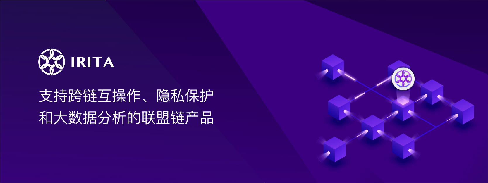

# IRITA OPB文档

## IRITA OPB简介

IRITA OPB 是边界智能在BSN环境中部署的一条基于智能合约的开放许可链。IRITA OPB 基于边界智能的 COSMOS/IRISnet SDK 公链底层技术，既利用了公链的成熟技术框架，又满足了中国市场的监管要求。提供对节点部署的许可控制，并取消使用 Token 支付 Gas 的机制，能更好的满足中小企业以更具成本效益的方式快速开发和部署 DApp 的需求。

IRITA OPB具有6大核心优势

- 共识底层：Tendermint是首个可以在互联网级别可应用的拜占庭共识协议，是Libra也沿用的共识技术
- 跨链IBC：国际合作团队贡献了业内公认的、最前沿跨链技术标准设计与实施
- 数据授权共享：数据在链上加密存储，保护各方数据所有权和隐私；只有用户授权，数据才会共享给第三方
- iService：链上链下各类型系统的交互，基于IRITA SDK将各类技术的有机结合、自然演进过渡
- 数字资产建模与交易：以供应链等实际场景切入，并可快速推广、扩展至知识产权、医药、存证等各行业
- 大数据支持：自带存储层支持云存储和分布式存储；数据仓库和链式数据结合支持链上数据高效全生命周期查询

## IRITA OPB解决方案整体架构

IRITA OPB的架构示例如下：

其中，IRITA OPB 可提供包括区块链核心层、接口层的强大底层支持功能。除了区块链之外，IRITA OPB 还集成了分布式存储、身份证书管理、隐私计算等链外能力。以IRITA底层平台为基础，开发者可为各行业灵活定制边缘应用服务（EdgeServer）以及业务应用，并可通过IBC和iService连接各类外部的异构系统。

### IRITA OPB服务

IRITA OPB 服务（又名“iService”）的目标是弥合区块链世界与传统商业应用世界之间的鸿沟，居中协调链下服务的整个生命周期 - 从定义、绑定（提供者注册）、调用，直到它们的治理（描画和仲裁）。

### 生命周期

- 定义：根据接口定义语言（IDL）文件定义链下iService可以做什么。
- 绑定：声明实现给​​定iService定义的提供者端点的位置（地址），定价和服务质量。
- 调用：处理针对给定iService提供者端点的消费者请求以及相应的提供者响应。

### 提供者

提供者 （Provider）是提供一个或多个iService定义实现的网络用户，通常充当位于其他公有链、联盟链以及企业现有系统中的链下服务和资源的 适配器。它们监听和处理传入的请求，并将响应发送回网络。提供者可以通过向其他提供者发送请求来同时充当消费者。按照计划，提供者需要为他们可能提供的服务收取费用。

### 消费者

消费者（Consumer）是那些使用iService的用户，他们向指定的提供者端点发送请求并接收相关提供者的响应。

### 分析员

分析员（Profiler）是一种特殊用户。分析员是在分析模式中调用iService的唯一授权用户，旨在帮助创建和维护服务提供者的分析画像，通过这些客观的分析画像服务消费者可以选择合适的服务提供者。

### 仲裁员

仲裁员 （Arbitrator）是自我声明的一类用户，他们协助消费者对投诉（服务提供者的表现）进行仲裁。

## 安装

考虑到安全问题，本软件不提供二进制文件方式安装，只提供源码安装，具体请参考安装[文档](get-started/installation.md)
